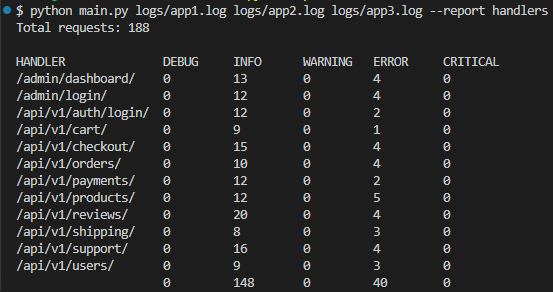

# apr-11-cli
Анализ журнала логирования

# Пример запуска приложения, скриншот формирования отчета

# Добавление нового типа отчета

1. Создать модуль с функциями init, process, result
2. Добавить в constants.py импорт модуля нового отчета и строчку в кортеж REPORTS с указанием имени отчета и функций инициализации отчета, обработки строки лог-файла, формирования текста отчета

За основу можно взять файл report_template.py
